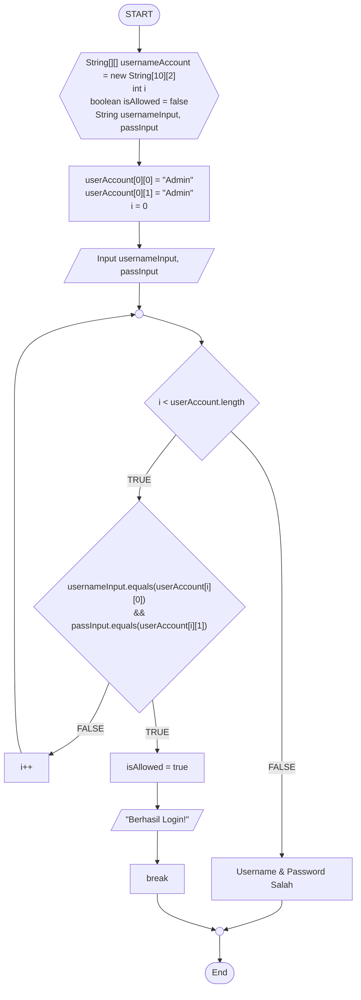

# Mermaid-JS Flowchart
Mermaid JS for Flowchart

```mermaid

flowchart TD
    A([START]) -->B{{"String[][] usernameAccount = new String[10][2]\nint i\nboolean isAllowed = false\nString usernameInput, passInput"}}
    B --> C["userAccount[0][0] = #quot;Admin#quot;\nuserAccount[0][1] = #quot;Admin#quot;\ni = 0"]
    C --> D[/"Input usernameInput, passInput"/]
    D --> E((" "))
    E --> F{"i < userAccount.length"}

    F -- FALSE --> L["Username & Password Salah"]
    L --> M((" "))
    M --> N(["End"])

    F -- TRUE --> G{"usernameInput.equals(userAccount[i][0])\n&&\npassInput.equals(userAccount[i][1])"}
    G -- FALSE --> H["i++"]
    H --> E
    G -- TRUE --> I["isAllowed = true"]
    I --> J[/"#quot;Berhasil Login!#quot;"/]
    J --> K["break"]
    K --> M

```

[Go to Top](#Mermaid-JS%20Flowchart)
